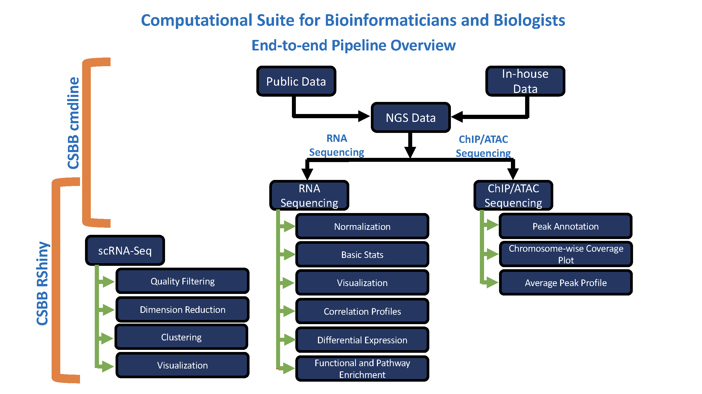

# CSBB-Shiny
Computational Suite for Bioinformaticians and Biologists (CSBB), is a RShiny application developed with an intention to empower researchers from wet and dry lab to perform downstream Bioinformatics analysis. CSBB powered by RShiny is packed with 8 modules Visualization, Normalization, Basic Stats, Differential Expression, Correlation Profiles, Function/Pathway Enrichment, ChIP-ATAC Seq and Single Cell RNA-Seq analysis. These modules are designed in order to help researchers design a hypothesis or answer research questions with little or no expertise in Bioinformatics. CSBB is also available as a command line application and has Next generation sequencing data processing capabilities. New modules and functionalities will be added periodically

# Run CSBB-Shiny from your R console or RStudio with one command
Open your R console or RStudio and paste the commands provided below. CSBB-Shiny will automatically install all required dependencies (R packages).

```
library(shiny)
runGitHub("CSBB-Shiny", "praneet1988", launch.browser = TRUE)

```
In case R package shiny is not installed please run the following command.

```
install.packages("shiny", repos="http://cran.us.r-project.org")
library(shiny)

```

# Dependencies
```
library(shiny)
library(servr)
library(ggplot2)
library(pheatmap)
library(M3C)
library(RUVSeq)
library(scales)
library(dtwclust)
library(dplyr)
library(ggcorrplot)
library(tibble)
library(ReactomePA)
library(org.Hs.eg.db)
library(org.Mm.eg.db)
library(AnnotationDbi)
library(EnhancedVolcano)
library(ChIPseeker)
library(TxDb.Hsapiens.UCSC.hg19.knownGene)
library(TxDb.Mmusculus.UCSC.mm10.knownGene)
library(TxDb.Hsapiens.UCSC.hg38.knownGene)
library(TxDb.Mmusculus.UCSC.mm9.knownGene)
library(clusterProfiler)
library(Seurat)
library(cowplot)
library(scater)
library(hdf5r)
library(DESeq2)
library(MAST)

```

# Please Access CSBB RShiny at: 
https://praneet1988.shinyapps.io/CSBB_Shiny/

# End to End Pipeline Workflow with CSBB


# Video Tutorial
https://youtu.be/c0P7TMu_IyY

# Single Cell Transcriptomics Analysis Tutorial
https://www.youtube.com/watch?v=s8Q4o1e-f1E
